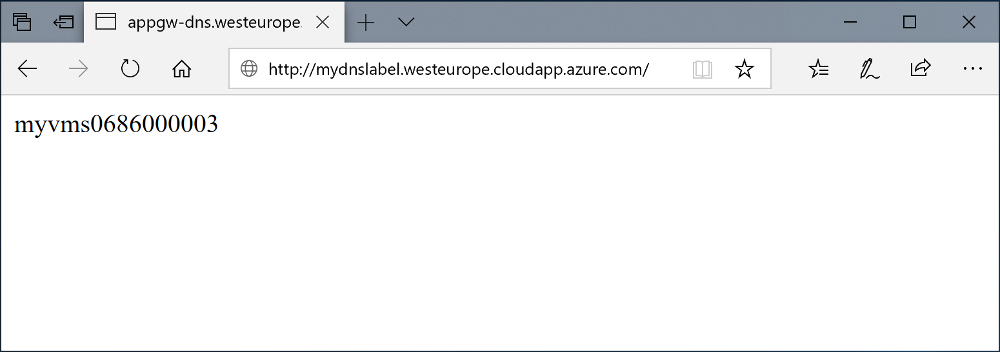

# Setup Application Gateway
Follow the instructions below to setup an Application Gateway in Azure with an NGINX-based virtual machine scale set

## Deploy resources
### Create resource group
```
az group create --name myResourceGroup --location westeurope
```

### Create network resources 
```
az network vnet create \
  --name myVNet \
  --resource-group myResourceGroup \
  --location westeurope \
  --address-prefix 10.0.0.0/16 \
  --subnet-name myAGSubnet \
  --subnet-prefix 10.0.1.0/24
az network vnet subnet create \
  --name myBackendSubnet \
  --resource-group myResourceGroup \
  --vnet-name myVNet \
  --address-prefix 10.0.2.0/24
```

### Create public IP with DNS label
Change **mydnslabel** to your unique FQDN (e.g. mydnslabel becomes mydnslabel.westeurope.cloudapp.azure.com) that you want to generate an automated SSL certificate for
```
az network public-ip create -g myResourceGroup -n myAGPublicIPAddress --dns-name mydnslabel
```

### Create application gateway
```
az network application-gateway create \
  --name myAppGateway \
  --location westeurope \
  --resource-group myResourceGroup \
  --vnet-name myVNet \
  --subnet myAGsubnet \
  --capacity 2 \
  --sku Standard_Medium \
  --http-settings-cookie-based-affinity Disabled \
  --frontend-port 80 \
  --http-settings-port 80 \
  --http-settings-protocol Http \
  --public-ip-address myAGPublicIPAddress
```

### Create virtual machine scale set
```
az vmss create \
  --name myvmss \
  --resource-group myResourceGroup \
  --image UbuntuLTS \
  --admin-username azureuser \
  --admin-password Azure123456! \
  --instance-count 2 \
  --vnet-name myVNet \
  --subnet myBackendSubnet \
  --vm-sku Standard_DS2 \
  --upgrade-policy-mode Automatic \
  --app-gateway myAppGateway \
  --backend-pool-name appGatewayBackendPool
```

### Install NGINX on VMSS
```
az vmss extension set \
  --publisher Microsoft.Azure.Extensions \
  --version 2.0 \
  --name CustomScript \
  --resource-group myResourceGroup \
  --vmss-name myvmss \
  --settings '{ "fileUris": ["https://raw.githubusercontent.com/Azure/azure-docs-powershell-samples/master/application-gateway/iis/install_nginx.sh"], "commandToExecute": "./install_nginx.sh" }'
```

### Test application gateway
Once everything is deployed, we can test if the (non-SSL enabled) application gateway works by pointing the browser to your newly created public ip.

To show the FQDN of your public IP:
```
az network public-ip show \
  --resource-group myResourceGroup \
  --name myAGPublicIPAddress \
  --query [ipAddress] \
  --output tsv
```

Now point your browser to the IP (e.g. mydnslabel.westeurope.cloudapp.azure.com) and it will should show the result below alternating between the different VMs in the scale set when refreshing


## Configure letsencrypt routing
To setup routing to complete the letsencrypt challenge, path-based application gateway routing needs to be setup by creating a new rule and applying that rule to the existing port 80 HTTPListener