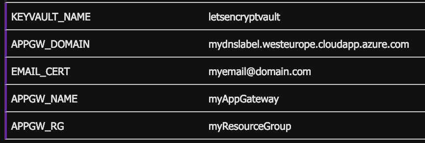

# Azure Functions 
Follow the steps below to deploy and setup both Azure Functions on your Azure subscription.

## Prerequisites 
Both the [Azure CLI](https://docs.microsoft.com/en-us/cli/azure/install-azure-cli?view=azure-cli-latest) and [Azure Function Core Tools](https://github.com/Azure/azure-functions-core-tools/tree/master) are required to deploy the resources and Azure Functions.

Ensure you have Azure Function Core Tools **v2** installed on your local machine. To install v2 with npm:
```
npm i -g azure-functions-core-tools --unsafe-perm true
```

## Deploy resources
First create an empty resource group
```
az group create --name myResourceGroup --location westeurope
```
Create an Azure Storage account
```
az storage account create --name myStorage --location westeurope --resource-group myResourceGroup --sku Standard_LRS
```
Create a Linux-based B1 SKU AppService plan (Consumer-based plans currently don't support MSI):
```
az appservice plan create -n myPlan -g myResourceGroup  --is-linux  --sku B1
```
Create Linux & Node-based Azure Function
```
az functionapp create -n myFunc --resource-group myResourceGroup -c westeurope  --storage-account myStorage --runtime node --os-type Linux
```

## Configure resources
Enable System-Assigned Managed Service Identity on the Function App:
```
az webapp identity assign --name myFunc --resource-group myResourceGroup
```
The above statement returns a **principalId** which is required in the next commands to enable the function app to alter other resources in the resource group (i.e. apply the issued SSL-certificate to the Application Gateway):
```
az role assignment create --role Owner --assignee-object-id <PrincipalId>
```
That same principalId is also required to setup permissions for the earlier created KeyVault to read/write secrets and certificates:
```
az keyvault set-policy --name '<YourKeyVaultName>' --object-id <PrincipalId> --secret-permissions delete get list set --certificate-permissions create delete get list update
```

### Setup environment variables
The Function App needs several variables set to communicate with KeyVault and Application Gateway. Go to Application Settings and add the appropriate values for the following variables `KEYVAULT_NAME`, `APPGW_DOMAIN`, `EMAIL_CERT`, `APPGW_NAME`, `APPGW_RG` as shown in the picture below:


## Publish code
Pull down this repository, cd into this directory and publish the Azure Functions to your newly created resource with:
```
func azure functionapp publish myFunc
```