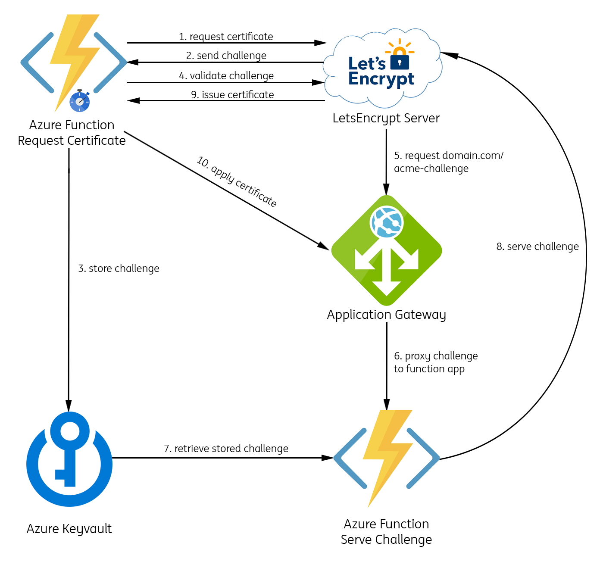
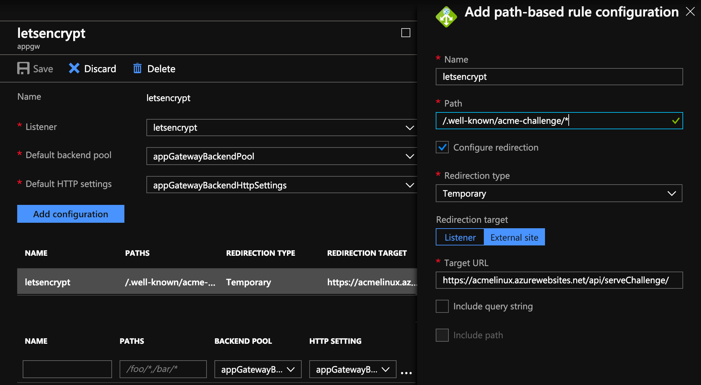

# Automated Application Gateway SSL encryption
Even though Azure Web Apps have several tools and extensions available to provide automated SSL encryption, Application Gateways don't have that same luxury. Since there is no VM or webserver available to request a certificate and validate the ACME challenge, the process with Application Gateways gets a little more complicated.

This repository is currently under active development

## Proposed solution
The proposed architecture and flow are shown in the figure below.

Apart from the Application Gateway you therefore need to deploy 2 Azure Functions and an Azure KeyVault. The flow is described in more detail below:
1. Time-triggered Azure Function requests a certifate for domain.com to the letsencrypt servers
2. The letsencrypt servers send a challenge back to the Azure Function
3. The Azure function stores this challenge in Azure Keyvault where the other Azure Function can read it from
4. The Azure Function notifies the letsencrypt server that it's ready to accept the challenge
5. The letsencrypt server hits domain.com/.well-known/acme-challenge/{challenge} where challenge is the unique challenge file
6. Once the application gateway is hit with this challenge, everything coming into /.well-known/acme-challenge/* is proxied to an Azure Function due to its configured path-based rules
7. The Azure function receives the challenge and looks for the {challenge} file in KeyVault
8. The contents of this file are served as the body in an 200 request back to letsencrypt
9. The Azure function has been polling for a new certificate in the meantime and after step 8 the status went from 'pending' to 'succes' and the SSL certificate can now be obtained
10. The SSL certificate is programmatically added to the Application Gateway

## Configuration

### Application Gateway
To proxy the incoming challenge from the AppGW and to serve the challenge through the Azure Function, path-based routing needs to be configured in the Application Gateway as follows:

The letsencrypt listener is configured to listen to port 80 and as shown in the picture an external site redirection is set up to capture all incoming /.well-known/acme-challenge/ requests to forward those to the configured target URL.
